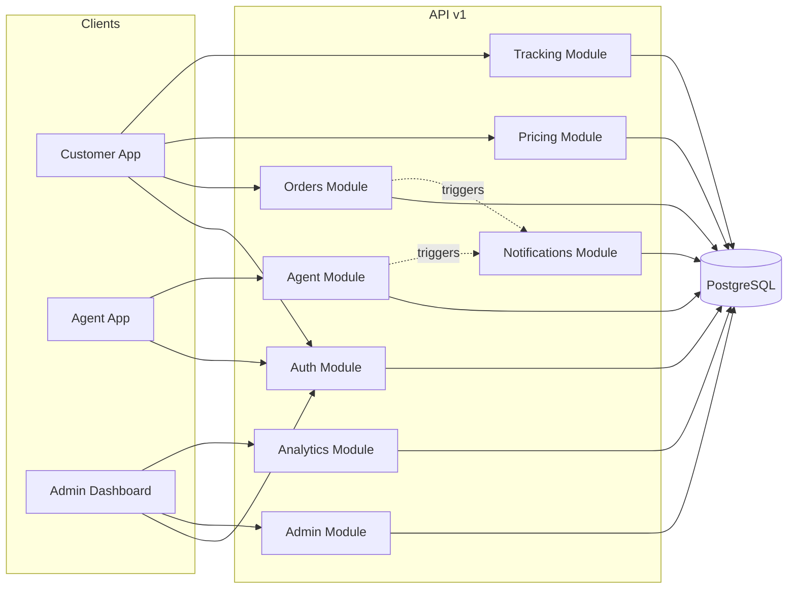
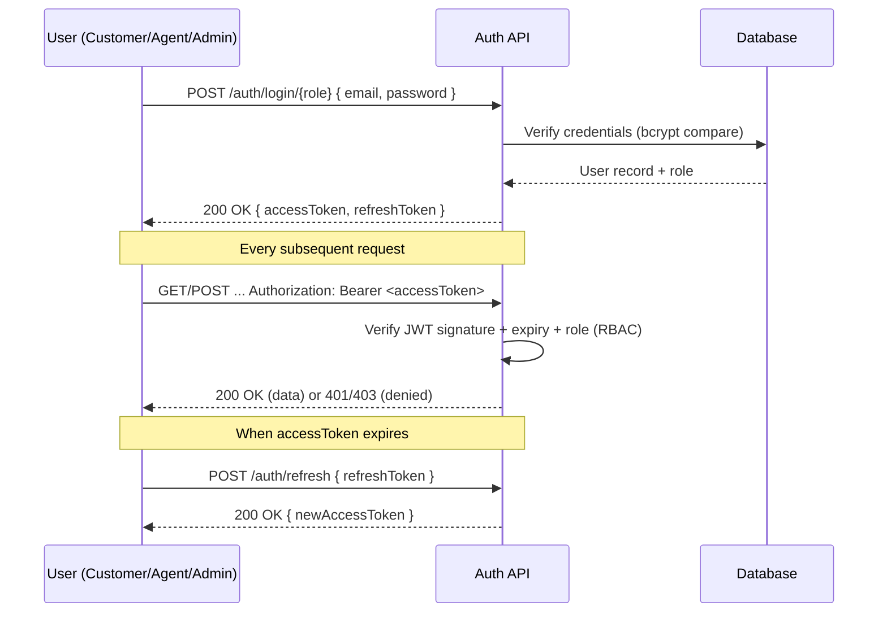
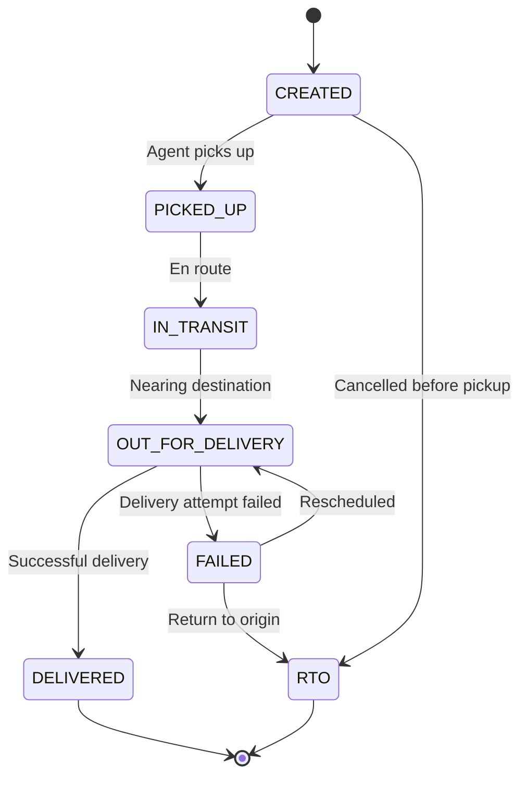
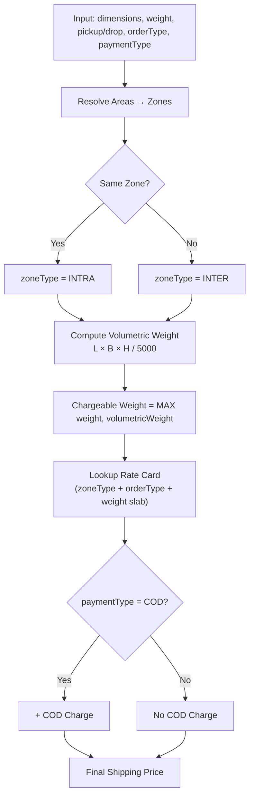
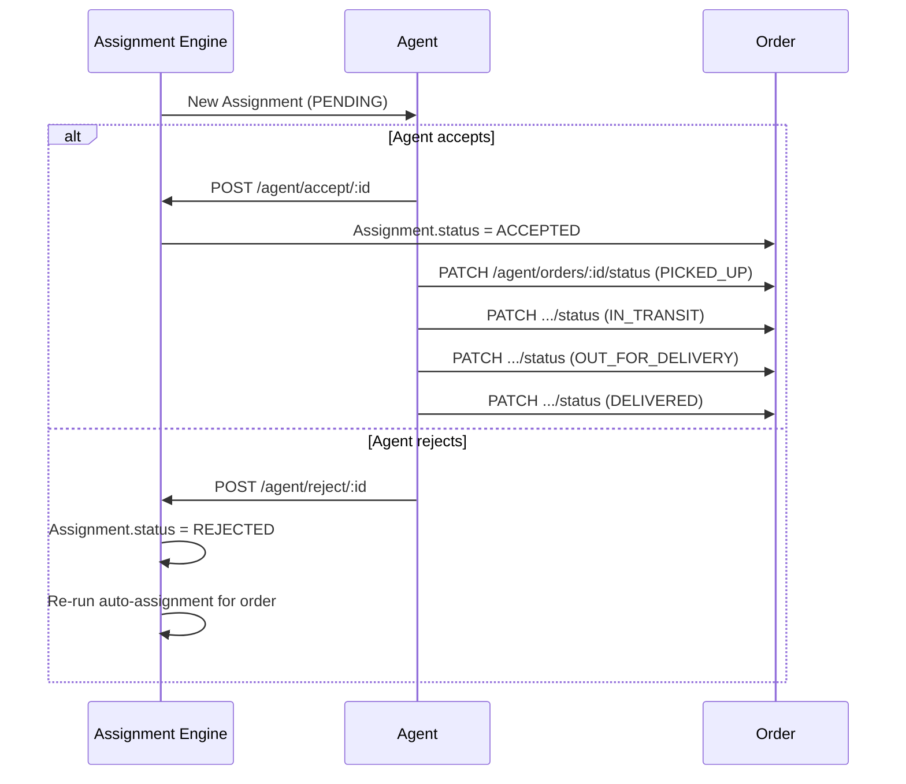
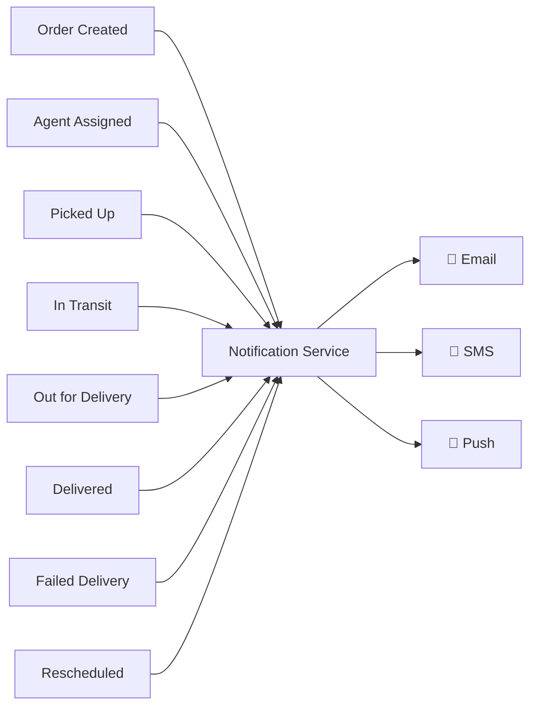
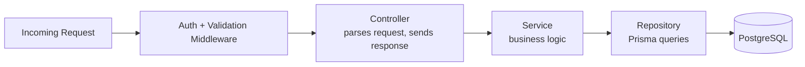

# 🌐 API Documentation

## Last-Mile Delivery Tracker

---

# 📖 Overview

The Last-Mile Delivery Tracker exposes a RESTful API that enables **customers**, **delivery agents**, and **administrators** to interact with the logistics platform.

The API follows REST principles with role-based access control (RBAC), JWT authentication, consistent request/response envelopes, and centralized error handling.

---

# 🛠 Base URLs

| Environment | URL |
|-------------|-----|
| Local Development | `http://localhost:4000/api/v1` |
| Production | `https://your-render-url.onrender.com/api/v1` |

**Interactive Docs (Swagger UI):**

| Environment | URL |
|-------------|-----|
| Local | `http://localhost:4000/docs` |
| Production | `https://your-render-url.onrender.com/docs` |

---

# 🗺️ API Surface at a Glance



---

# 🔐 Authentication & Authorization

All protected endpoints require a JWT access token in the header:

```http
Authorization: Bearer <JWT_TOKEN>
```

### Login & Token Flow



### Role-Based Access Summary

| Role | Can Access |
|------|-----------|
| **Customer** | Create/view own orders, calculate pricing, track own shipments |
| **Agent** | View assigned orders, accept/reject assignments, update delivery status |
| **Admin** | Full system access — zones, areas, rate cards, manual assignment, analytics, status overrides |

---

# 👥 API Modules

| Module | Purpose |
|---------|----------|
| 🔑 Authentication | Login, Register, Refresh Token |
| 📦 Orders | Create and manage delivery orders |
| 💰 Pricing | Calculate shipping charges |
| 📍 Tracking | View tracking timeline |
| 🚚 Agent | Delivery workflow |
| 🛡 Admin | System management |
| 📊 Analytics | Dashboard metrics |
| 📧 Notifications | Email/SMS/Push updates |

---

# 🔑 Authentication APIs

| Method | Endpoint | Access | Description |
|---------|-----------|--------|-------------|
| `POST` | `/auth/register` | Public | Register a new customer |
| `POST` | `/auth/login/customer` | Public | Customer login |
| `POST` | `/auth/login/agent` | Public | Agent login |
| `POST` | `/auth/login/admin` | Public | Admin login |
| `POST` | `/auth/refresh` | Authenticated | Refresh access token |
| `POST` | `/auth/logout` | Authenticated | Invalidate refresh token |

<details>
<summary><b>Request/Response example — POST /auth/login/customer</b></summary>

**Request**
```json
{
  "email": "customer@example.com",
  "password": "SecurePass123"
}
```

**Response — 200 OK**
```json
{
  "success": true,
  "message": "Login successful",
  "data": {
    "accessToken": "eyJhbGciOi...",
    "refreshToken": "dGhpcyBpcy...",
    "user": {
      "id": "usr_8f3a",
      "name": "Riya Sharma",
      "role": "CUSTOMER"
    }
  }
}
```
</details>

---

# 📦 Order APIs

| Method | Endpoint | Access | Description |
|---------|-----------|--------|-------------|
| `POST` | `/orders` | Customer/Admin | Create a new order |
| `GET` | `/orders` | Customer/Admin | List orders (filterable, paginated) |
| `GET` | `/orders/:id` | Authenticated | Get single order details |
| `PATCH` | `/orders/:id` | Customer/Admin | Update order (before pickup only) |
| `DELETE` | `/orders/:id` | Admin | Cancel order |

### Order Status Lifecycle

Every order moves through a strict state machine — this maps directly to the `Order.status` enum and generates a `TrackingEvent` row at each transition.



### Query Parameters — `GET /orders`

| Param | Type | Description |
|-------|------|-------------|
| `status` | string | Filter by order status |
| `orderType` | string | `B2B` / `B2C` |
| `page` | number | Pagination page (default `1`) |
| `limit` | number | Page size (default `20`, max `100`) |
| `from`, `to` | ISO date | Date range filter on `createdAt` |

---

# 💰 Pricing APIs

| Method | Endpoint | Access | Description |
|---------|-----------|--------|-------------|
| `POST` | `/pricing/calculate` | Customer/Admin | Calculate shipping charges before order creation |

### Pricing Engine Logic



<details>
<summary><b>Request/Response example — POST /pricing/calculate</b></summary>

**Request**
```json
{
  "pickupAddress": "Kothrud, Pune",
  "dropAddress": "Andheri, Mumbai",
  "length": 40,
  "breadth": 30,
  "height": 20,
  "weight": 4.5,
  "orderType": "B2C",
  "paymentType": "COD"
}
```

**Response — 200 OK**
```json
{
  "success": true,
  "data": {
    "zoneType": "INTER",
    "volumetricWeight": 4.8,
    "chargeableWeight": 4.8,
    "baseCharge": 190,
    "codCharge": 30,
    "finalPrice": 220
  }
}
```
</details>

---

# 🚚 Agent APIs

| Method | Endpoint | Access | Description |
|---------|-----------|--------|-------------|
| `GET` | `/agent/orders` | Agent | View orders assigned to the logged-in agent |
| `PATCH` | `/agent/orders/:id/status` | Agent | Update delivery status (creates a Tracking Event) |
| `POST` | `/agent/accept/:assignmentId` | Agent | Accept an assignment |
| `POST` | `/agent/reject/:assignmentId` | Agent | Reject an assignment (triggers reassignment) |

### Assignment → Delivery Flow



---

# 🛡 Admin APIs

| Method | Endpoint | Description |
|---------|-----------|-------------|
| `GET` | `/admin/orders` | View all orders across the platform |
| `GET` | `/admin/analytics` | Dashboard metrics |
| `POST` | `/admin/zones` | Create a zone |
| `POST` | `/admin/areas` | Create an area (linked to a zone) |
| `POST` | `/admin/rate-cards` | Create a pricing rule |
| `POST` | `/admin/assign` | Manually assign an order to an agent |
| `PATCH` | `/admin/orders/:id/status` | Override order status |

---

# 📍 Tracking APIs

| Method | Endpoint | Access | Description |
|---------|-----------|--------|-------------|
| `GET` | `/tracking/:trackingNumber` | Public | Public tracking lookup — no login required |
| `GET` | `/orders/:id/tracking` | Customer/Admin | Full tracking timeline for an order |

<details>
<summary><b>Response example — GET /tracking/:trackingNumber</b></summary>

```json
{
  "success": true,
  "data": {
    "trackingNumber": "ORD-1001",
    "currentStatus": "OUT_FOR_DELIVERY",
    "timeline": [
      { "status": "CREATED", "timestamp": "2026-07-10T09:00:00Z" },
      { "status": "PICKED_UP", "timestamp": "2026-07-10T11:20:00Z" },
      { "status": "IN_TRANSIT", "timestamp": "2026-07-11T06:00:00Z" },
      { "status": "OUT_FOR_DELIVERY", "timestamp": "2026-07-12T08:45:00Z" }
    ]
  }
}
```
</details>

---

# 📧 Notification APIs

Notifications are triggered automatically (no direct client-facing "send" endpoint) whenever an order crosses a key event:



Each send attempt — successful or not — is logged as a `Notification` row (`SENT` / `FAILED` / `PENDING`) for audit purposes.

---

# 📊 Analytics APIs

| Endpoint | Description |
|-----------|-------------|
| `GET /admin/analytics` | Overall dashboard metrics (volume, revenue, SLA adherence) |
| `GET /admin/orders` | Order statistics with filters |
| `GET /admin/agents` | Agent performance (deliveries, acceptance rate, avg. time) |

---

# 📥 Sample Request

## Create Order

```http
POST /api/v1/orders
```

```json
{
  "pickupAddress": "Pune",
  "dropAddress": "Mumbai",
  "length": 40,
  "breadth": 30,
  "height": 20,
  "weight": 4.5,
  "orderType": "B2C",
  "paymentType": "COD"
}
```

---

# 📤 Sample Response

```json
{
  "success": true,
  "message": "Order created successfully",
  "data": {
    "orderId": "ORD-1001",
    "shippingCharge": 220,
    "status": "CREATED"
  }
}
```

---

# ❌ Error Response

Every error follows the same envelope, regardless of module:

```json
{
  "success": false,
  "message": "Validation failed",
  "errors": [
    {
      "field": "pickupAddress",
      "message": "Pickup address is required"
    }
  ]
}
```

### Standard HTTP Status Codes

| Code | Meaning | Typical Cause |
|------|---------|----------------|
| `200` | OK | Successful GET/PATCH |
| `201` | Created | Successful POST (resource created) |
| `400` | Bad Request | Validation failure (Zod schema) |
| `401` | Unauthorized | Missing/expired/invalid JWT |
| `403` | Forbidden | Valid token, wrong role (RBAC denial) |
| `404` | Not Found | Resource doesn't exist |
| `409` | Conflict | Duplicate email, double-assignment, etc. |
| `500` | Internal Server Error | Unhandled exception |

---

# 🔒 Security Features

- ✅ JWT Authentication (access + refresh token pair)
- ✅ Password Hashing (bcrypt)
- ✅ RBAC Authorization on every protected route
- ✅ Input Validation (Zod schemas at controller boundary)
- ✅ Centralized Error Handling middleware
- ✅ Protected Routes via auth middleware
- ✅ Environment-based Configuration (`.env`, never hardcoded secrets)

---

# 📌 API Design Principles

- RESTful architecture, resource-oriented URLs
- Feature-based routing (one router per module)
- Consistent `{ success, message, data | errors }` response envelope
- Proper, meaningful HTTP status codes
- Stateless authentication (JWT, no server-side session)
- Modular **controller → service → repository** pattern



---

# 🚀 Future API Enhancements

| Enhancement | Benefit |
|-------------|---------|
| Versioned APIs (`v2`) | Non-breaking evolution of the contract |
| WebSocket support | Real-time order status push instead of polling |
| GraphQL gateway | Flexible querying for dashboard/analytics clients |
| Rate limiting | Abuse prevention, fair usage |
| API key support | Enable B2B partner integrations |
| OpenAPI code generation | Auto-generate typed SDKs from the Swagger spec |

---

# 📖 Complete Documentation

For detailed request bodies, response schemas, and interactive testing, refer to the Swagger documentation:

- **Local:** `http://localhost:4000/docs`
- **Production:** `https://your-render-url.onrender.com/docs`
