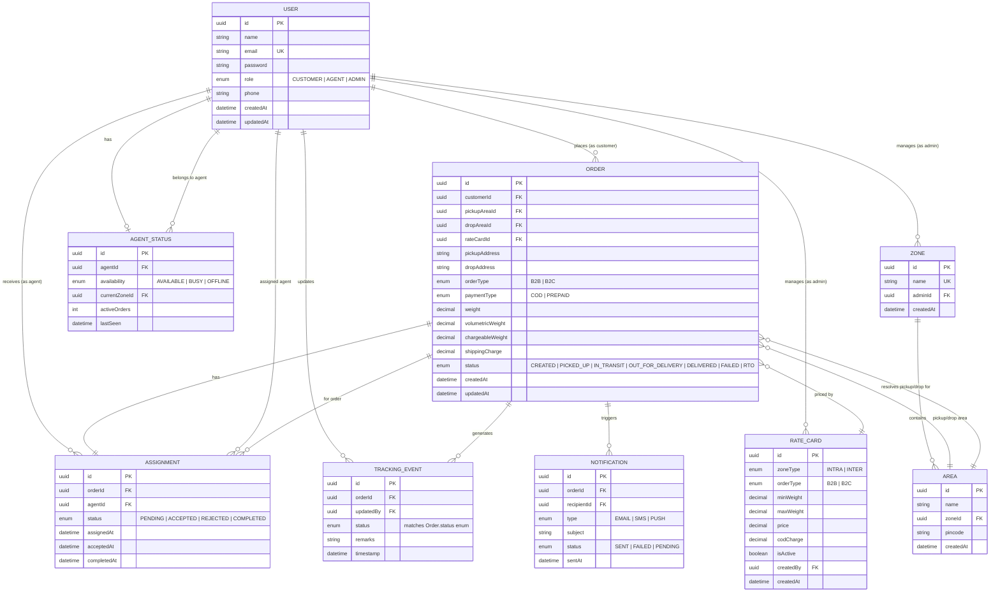

# 🗄️ Database Schema

## Last-Mile Delivery Tracker

---

# 📖 Overview

The Last-Mile Delivery Tracker uses **PostgreSQL** as its primary relational database with **Prisma ORM** for type-safe database access and schema migrations.

The schema is normalized (3NF) to reduce redundancy while maintaining data integrity. Core logistics entities — orders, delivery agents, pricing rules, assignments, and tracking events — are connected through well-defined foreign-key relationships, with audit and history tables kept append-only for traceability.

---

# 🏛 High-Level Architecture

```text
                              Users
                                │
            ┌───────────────────┼───────────────────┐
            │                   │                   │
            ▼                   ▼                   ▼
       Customers             Agents            Administrators
            │                   │                   │
            │                   ▼                   ▼
            │             Agent Status        Rate Cards / Zones
            │                   │
            ▼                   ▼
          Orders  ◄───────  Assignments
            │
   ┌────────┼─────────────────────┬───────────────┐
   ▼        ▼                     ▼               ▼
Tracking  Notifications      Payments *      Delivery Proof *
Events                                        (image/POD)

Zones ──► Areas ──► used to resolve Order pickup/drop
Rate Cards ──► priced against Order (zoneType, orderType, weight slab)

  * = suggested extension entities (see Scalability section)
```

---

# 📊 Entity Relationship Diagram



> **Note:** GitHub, GitLab, and most modern Markdown renderers (and the Mermaid Live Editor) render this diagram natively — no exported PNG needed. If your renderer doesn't support Mermaid, paste the block into https://mermaid.live to export an image.

---

# 📦 Core Database Entities

---

## 👤 User

Stores authentication and profile information for every system user (single-table role model via `role` enum).

| Field | Type | Description |
|--------|------|-------------|
| id | UUID (PK) | Primary Key |
| name | String | Full Name |
| email | String (UNIQUE) | Login Email |
| password | String | Hashed Password (bcrypt/argon2) |
| role | Enum | `CUSTOMER` / `AGENT` / `ADMIN` |
| phone | String | Contact Number |
| createdAt | DateTime | Account Creation |
| updatedAt | DateTime | Last Profile Update |

**Indexes:** `email` (unique), `role`
**Relationships:**
- Customer → creates many **Orders**
- Agent → receives many **Assignments**, has one **Agent Status**
- Admin → manages **Rate Cards**, **Zones**, and **Areas**

---

## 📦 Order

Represents a delivery request — the central entity of the schema.

| Field | Type | Description |
|--------|------|-------------|
| id | UUID (PK) | Order ID |
| customerId | UUID (FK → User) | Owner |
| pickupAreaId | UUID (FK → Area) | Resolved Pickup Area |
| dropAreaId | UUID (FK → Area) | Resolved Drop Area |
| rateCardId | UUID (FK → RateCard) | Pricing Rule Applied |
| pickupAddress | String | Full Pickup Address |
| dropAddress | String | Full Destination Address |
| orderType | Enum | `B2B` / `B2C` |
| paymentType | Enum | `COD` / `PREPAID` |
| weight | Decimal | Actual Weight (kg) |
| volumetricWeight | Decimal | Calculated Weight |
| chargeableWeight | Decimal | max(weight, volumetricWeight) |
| shippingCharge | Decimal | Final Price (from Rate Card) |
| status | Enum | `CREATED → PICKED_UP → IN_TRANSIT → OUT_FOR_DELIVERY → DELIVERED / FAILED / RTO` |
| createdAt | DateTime | Order Placed |
| updatedAt | DateTime | Last Modified |

**Indexes:** `customerId`, `status`, `(pickupAreaId, dropAreaId)`, `createdAt`
**Relationships:**
- Belongs to one **Customer**
- Belongs to one **Rate Card** (pricing snapshot)
- Belongs to **Pickup/Drop Area**
- Has one **Assignment**
- Has many **Tracking Events**, **Notifications**

---

## 🚴 Agent Status

Stores the real-time operational status of delivery agents, consumed by the auto-assignment engine.

| Field | Type | Description |
|--------|------|-------------|
| id | UUID (PK) | Primary Key |
| agentId | UUID (FK → User, UNIQUE) | Linked Agent |
| availability | Enum | `AVAILABLE` / `BUSY` / `OFFLINE` |
| currentZoneId | UUID (FK → Zone) | Active Zone |
| activeOrders | Int | Current Deliveries in Progress |
| lastSeen | DateTime | Last Heartbeat / Activity |

**Indexes:** `agentId` (unique), `(availability, currentZoneId)` — composite index to speed up nearest-available-agent lookups.

---

## 📍 Zone

Represents a top-level logistics zone (e.g., a city quadrant).

| Field | Type | Description |
|--------|------|-------------|
| id | UUID (PK) | Primary Key |
| name | String (UNIQUE) | e.g. `Pune East`, `Pune West`, `Mumbai North` |
| adminId | UUID (FK → User) | Zone Owner/Manager |
| createdAt | DateTime | Created Timestamp |

**Relationships:** One Zone → many Areas.

---

## 📍 Area

Sub-region belonging to a Zone; used to resolve pickup/drop locations and match Rate Cards.

| Field | Type | Description |
|--------|------|-------------|
| id | UUID (PK) | Primary Key |
| name | String | e.g. `Kothrud`, `Baner`, `Hadapsar` |
| zoneId | UUID (FK → Zone) | Parent Zone |
| pincode | String | Postal Code |
| createdAt | DateTime | Created Timestamp |

**Indexes:** `zoneId`, `pincode`

| Area | Zone |
|------|------|
| Kothrud | Pune West |
| Baner | Pune West |
| Hadapsar | Pune East |

---

## 💰 Rate Card

Stores configurable, versioned pricing rules — no shipping price is ever hardcoded in application code.

| Field | Type | Description |
|--------|------|-------------|
| id | UUID (PK) | Primary Key |
| zoneType | Enum | `INTRA` (same zone) / `INTER` (cross zone) |
| orderType | Enum | `B2B` / `B2C` |
| minWeight | Decimal | Weight Slab Start |
| maxWeight | Decimal | Weight Slab End |
| price | Decimal | Shipping Price |
| codCharge | Decimal | COD Surcharge |
| isActive | Boolean | Enables soft-retiring old slabs instead of deleting |
| createdBy | UUID (FK → User) | Admin who created the rule |
| createdAt | DateTime | Created Timestamp |

**Indexes:** `(zoneType, orderType, minWeight, maxWeight)` composite — for fast slab lookup during pricing.
**Design note:** Orders store a `rateCardId` snapshot reference so historical orders remain correctly priced even if rates change later.

---

## 🚚 Assignment

Links delivery agents with orders (1:1 with Order at any given time; historical reassignment tracked via status, not deletion).

| Field | Type | Description |
|--------|------|-------------|
| id | UUID (PK) | Primary Key |
| orderId | UUID (FK → Order, UNIQUE) | Assigned Order |
| agentId | UUID (FK → User) | Assigned Agent |
| status | Enum | `PENDING` / `ACCEPTED` / `REJECTED` / `COMPLETED` |
| assignedAt | DateTime | Assignment Created |
| acceptedAt | DateTime? | Acceptance Time |
| completedAt | DateTime? | Delivery Completion Time |

**Indexes:** `orderId` (unique), `agentId`, `status`
Supports both manual (admin-triggered) and automatic (engine-triggered) assignment flows.

---

## 📜 Tracking Event

Maintains an immutable, append-only delivery history — each status change **inserts** a new row rather than updating one.

| Field | Type | Description |
|--------|------|-------------|
| id | UUID (PK) | Primary Key |
| orderId | UUID (FK → Order) | Related Order |
| status | Enum | Delivery Status at this point in time |
| updatedBy | UUID (FK → User) | Actor (agent/system/admin) |
| remarks | String? | Optional Notes |
| timestamp | DateTime | Status Change Time |

**Indexes:** `(orderId, timestamp)` composite — powers the customer-facing tracking timeline.

---

## 📧 Notification

Stores outbound notification history for auditing.

| Field | Type | Description |
|--------|------|-------------|
| id | UUID (PK) | Primary Key |
| orderId | UUID (FK → Order) | Related Order |
| recipientId | UUID (FK → User) | Customer (or Agent) |
| type | Enum | `EMAIL` / `SMS` / `PUSH` |
| subject | String | Message Subject |
| status | Enum | `SENT` / `FAILED` / `PENDING` |
| sentAt | DateTime | Timestamp |

**Indexes:** `orderId`, `(recipientId, sentAt)`

---

# 🔗 Relationship Summary

| Relationship | Type | Notes |
|--------------|------|-------|
| User (Customer) → Orders | 1 : N | Each order has exactly one customer |
| User (Agent) → Assignments | 1 : N | An agent can hold many assignments over time |
| User (Agent) → Agent Status | 1 : 1 | One live status row per agent |
| Order → Assignment | 1 : 1 | Current active assignment |
| Order → Tracking Events | 1 : N | Append-only history |
| Order → Notifications | 1 : N | Every send is logged |
| Order → Rate Card | N : 1 | Snapshot pricing reference |
| Zone → Areas | 1 : N | |
| Area → Orders | 1 : N | Both pickup and drop reference Area |
| Rate Card → Orders | 1 : N | |

---

# 🛡 Data Integrity

| Mechanism | Purpose |
|-----------|---------|
| **Primary Keys (UUID)** | Globally unique, non-guessable identifiers; safe for distributed systems |
| **Foreign Keys** | Enforce referential integrity across all relationships |
| **Unique Constraints** | `User.email`, `Zone.name`, `Assignment.orderId` |
| **Cascading Rules** | `ON DELETE RESTRICT` on Order/User references (prevent orphaned financial/history data); `ON DELETE CASCADE` only on purely dependent rows (e.g. Tracking Events on Order deletion, if hard-delete is ever enabled) |
| **Check Constraints** | `maxWeight > minWeight` on Rate Card; `chargeableWeight = GREATEST(weight, volumetricWeight)` |
| **Enums** | Restrict `role`, `status`, `orderType`, `paymentType`, `zoneType` to valid values at the DB level |
| **Prisma Validation** | Type-safe schema enforcement at the application layer, mirroring DB constraints |
| **Append-only tables** | `TrackingEvent` and `Notification` are insert-only — no updates/deletes, preserving a full audit trail |

These constraints prevent orphan records and ensure every assignment, tracking event, and pricing record remains associated with valid entities.

---

# ⚡ Performance & Indexing Strategy

- **Hot-path composite indexes**: `AgentStatus(availability, currentZoneId)` for the assignment engine's nearest-agent query; `TrackingEvent(orderId, timestamp)` for the tracking timeline; `RateCard(zoneType, orderType, minWeight, maxWeight)` for price lookups.
- **Partial index** on `Order.status` for active (non-terminal) orders, since dashboards query "in-flight" orders far more often than delivered/failed ones.
- **Soft-delete pattern** (`isActive` flag) on Rate Card avoids breaking historical Order references.
- Consider **table partitioning** on `TrackingEvent` and `Notification` by month once volume grows, since both are append-only and time-ordered.

---

# 📈 Scalability Considerations

The schema is designed to support future expansion without breaking existing relationships:

| Enhancement | Suggested Approach |
|-------------|--------------------|
| Multi-warehouse support | New `Warehouse` entity linked to `Area`; Orders gain optional `warehouseId` |
| Regional pricing | Extend `RateCard` with a `regionId` FK instead of flat zone type |
| Vehicle management | New `Vehicle` entity (1:N from Agent) with capacity/type fields |
| Fleet tracking / real-time GPS | New `AgentLocation` time-series table (or external store like TimescaleDB/Redis) |
| Driver shifts | New `Shift` entity linking Agent, start/end time, Zone |
| Payment transactions | New `Payment` entity (1:1 or 1:N from Order) for COD reconciliation and prepaid gateway references |
| Invoice generation | New `Invoice` entity aggregating Orders over a billing period, especially for B2B customers |
| Delivery proof uploads | New `DeliveryProof` entity storing image/signature URLs, linked 1:1 to completed Assignment |

---

# 📌 Summary

The database schema is designed around normalized relational models that separate authentication, pricing, assignment, tracking, and operational data. Foreign keys, enums, and composite indexes enforce integrity and keep hot-path queries fast, while append-only history tables (Tracking Events, Notifications) preserve a full audit trail. This modular structure improves maintainability, simplifies future feature additions, and supports scalable last-mile logistics operations.
