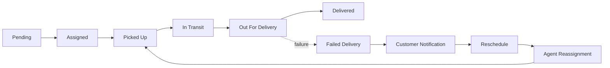
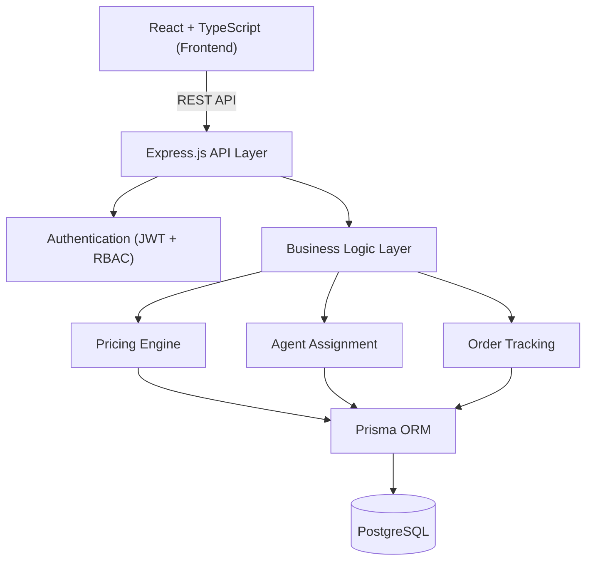

<div align="center">

# 🚚 Last-Mile Delivery Tracker

**A production-inspired logistics management platform** — automated pricing, intelligent delivery-agent assignment, live order tracking, and real-time customer notifications.

[](#)
[](#)
[](#)
[](#)
[](#)
[](#)
[](#)
[](#license)

[Live Demo](#) · [API Docs](#api-documentation) · [Report Bug](#) · [Request Feature](#)

</div>

---

## 📖 Overview

**Last-Mile Delivery Tracker** is a full-stack logistics platform built to simulate the systems that power real-world courier and delivery companies — the kind of engine behind checkout-page delivery estimates, live "your order is out for delivery" tracking, and the dispatch logic that decides which driver gets which job.

Rather than another CRUD demo, this project tackles the operational problems logistics companies actually deal with:

| Problem | How it's solved |
|---|---|
| **Dynamic pricing** | Rate-card-driven pricing engine — zero hardcoded prices |
| **Zone-based delivery** | Pickup/drop addresses resolved to zones to classify intra- vs. inter-zone shipments |
| **Volumetric vs. actual weight** | Industry-standard `(L × W × H) / 5000` formula, billed on whichever is greater |
| **Delivery agent assignment** | Manual admin assignment or automatic assignment by availability, zone, and capacity |
| **Order lifecycle & tracking** | A finite state machine with a full, immutable timeline of every status change |
| **Access control** | JWT-based auth with distinct Customer / Admin / Agent roles and permissions |

---

## ✨ Key Features

<table>
<tr>
<td valign="top" width="33%">

### 👤 Customer
- Registration & secure login
- JWT-based authentication
- Create delivery orders
- Google Maps address autocomplete
- Automatic shipping-charge calculation
- Live order tracking
- Full tracking timeline
- Email notifications
- Order history

</td>
<td valign="top" width="33%">

### 🛠️ Admin
- Analytics dashboard
- Manage zones & service areas
- Configure rate cards
- Manage delivery agents & customers
- Create orders on a customer's behalf
- Manual **and** automatic agent assignment
- Override order status
- Order filtering & search
- Delivery analytics

</td>
<td valign="top" width="33%">

### 🏍️ Delivery Agent
- Secure login
- Assigned-orders dashboard
- Update delivery status in real time
- Delivery history
- End-to-end order completion workflow

</td>
</tr>
</table>

---

## 🚀 Core Functionalities

### 💰 Intelligent Pricing Engine

Shipping charges are calculated automatically from configurable business rules — **no price is ever hardcoded**; every rate is admin-configurable via Rate Cards.

```
Actual Weight ──┐
                ├──▶ Chargeable Weight = max(Actual, Volumetric)
Volumetric Wt ──┘              │
                                ▼
                        Zone Detection (Intra / Inter)
                                │
                                ▼
                      B2B / B2C Rate Card Lookup
                                │
                                ▼
                    COD Surcharge (if applicable)
                                │
                                ▼
                       Final Shipping Charge
```

**Volumetric weight** uses the industry-standard formula:

$$\text{Volumetric Weight} = \frac{L \times W \times H}{5000}$$

### 📍 Zone Detection

Every service area belongs to a logistics zone. On order creation:

```
Pickup Address → Pickup Area → Pickup Zone
   Drop Address → Drop Area   → Drop Zone
```

The resulting zone pair determines whether a shipment is priced as **Intra-Zone** or **Inter-Zone**, which feeds directly into the pricing engine.

### 🤖 Smart Agent Assignment

| Mode | Behavior |
|---|---|
| **Manual** | Admin selects a delivery agent directly |
| **Automatic** | The platform selects the best available agent based on availability, assigned zone, and current delivery capacity |

### 📦 Order Lifecycle

Every order moves through a well-defined state machine, with every transition logged as an immutable tracking event:



### 🧾 Tracking History

Every status change writes a permanent tracking record capturing:

- **Status**
- **Timestamp**
- **Updated by**
- **Remarks**

giving customers — and admins — full delivery transparency.

### 📧 Notifications

Customers are notified automatically at every key milestone:

`Order Created` → `Agent Assigned` → `Picked Up` → `In Transit` → `Out for Delivery` → `Delivered` / `Delivery Failed` → `Rescheduled`

---

## 🏗️ System Architecture



---

## 🧰 Tech Stack

| Layer | Technologies |
|---|---|
| **Frontend** | React · TypeScript · Vite · React Router · React Hook Form · Tailwind CSS · Axios · Google Maps API |
| **Backend** | Node.js · Express.js · TypeScript · Prisma ORM · JWT Authentication · Bcrypt · Zod Validation · Nodemailer |
| **Database** | PostgreSQL, managed via Prisma ORM |
| **Deployment** | Frontend → Vercel · Backend → Render · Database → PostgreSQL (managed) |

---

## 📂 Project Structure

```
last-mile-delivery-tracker/
├── frontend/               # React + TypeScript client
├── backend/                # Express + Prisma API
├── docs/
│   ├── SYSTEM_DESIGN.md
│   ├── API_DOCUMENTATION.md
│   ├── DATABASE_SCHEMA.md
│   ├── RATE_CALCULATION.md
│   └── FEATURES.md
├── screenshots/
└── README.md
```

---

## 🔐 Authentication

Role-based authentication across three roles — **Customer**, **Delivery Agent**, and **Administrator** — implemented with:

- JWT access tokens
- Password hashing via bcrypt
- Protected routes
- Role-based authorization middleware

---

## 🗄️ Database Models

| Entity | Purpose |
|---|---|
| `Users` | Customers, agents, and admins with role-based fields |
| `Orders` | Core delivery order records |
| `AgentStatus` | Delivery agent availability, capacity, and location |
| `Zones` / `Areas` | Geographic hierarchy driving pricing and assignment |
| `RateCards` | Admin-configurable pricing rules |
| `TrackingEvent` | Immutable status-change history per order |
| `Assignment` | Order ↔ agent assignment records |

Full schema documentation: [`docs/DATABASE_SCHEMA.md`](./docs/DATABASE_SCHEMA.md)

---

## ⚡ Getting Started

### Clone the repository

```bash
git clone https://github.com/pruthvimotade/last-mile-delivery-tracker.git
cd last-mile-delivery-tracker
```

### Backend setup

```bash
cd backend
npm install
cp .env.example .env
npm run prisma:generate
npm run prisma:migrate
npm run seed
npm run dev
```

### Frontend setup

```bash
cd frontend
npm install
npm run dev
```

### Environment variables

Create a `.env` file inside `backend/`:

```env
DATABASE_URL=
JWT_SECRET=
JWT_REFRESH_SECRET=
GOOGLE_MAPS_API_KEY=
SMTP_HOST=
SMTP_PORT=
SMTP_USER=
SMTP_PASS=
FRONTEND_URL=
BACKEND_URL=
```

---

## 📘 API Documentation

Interactive Swagger documentation is available once the backend is running:

| Environment | URL |
|---|---|
| Local | `http://localhost:4000/docs` |
| Hosted | `https://<your-render-url>/docs` |

---

## 📸 Screenshots

> Add screenshots to `screenshots/` — recommended set: Login · Register · Customer Dashboard · Admin Dashboard · Create Order · Live Tracking · Analytics · Rate Cards · Agent Dashboard

---

## 🛣️ Roadmap

- [ ] SMS notifications
- [ ] Live GPS tracking
- [ ] Route optimization
- [ ] AI-based delivery time prediction
- [ ] Driver performance analytics
- [ ] Payment gateway integration
- [ ] Push notifications
- [ ] Multi-warehouse support
- [ ] Delivery heatmaps
- [ ] Mobile application

---

## 👨‍💻 Author

**Pruthviraj Motade**
Computer Engineering Undergraduate · Vishwakarma Institute of Technology, Pune

[](https://github.com/pruthvimotade)
[](https://www.linkedin.com/in/pruthvimotade/)

---

## 📄 License

This project was built as a full-stack logistics engineering deep-dive — demonstrating backend architecture, pricing-engine design, intelligent delivery assignment, and scalable software engineering practices end to end.

Licensed under the [MIT License](./LICENSE). Fork it, explore it, learn from it.
