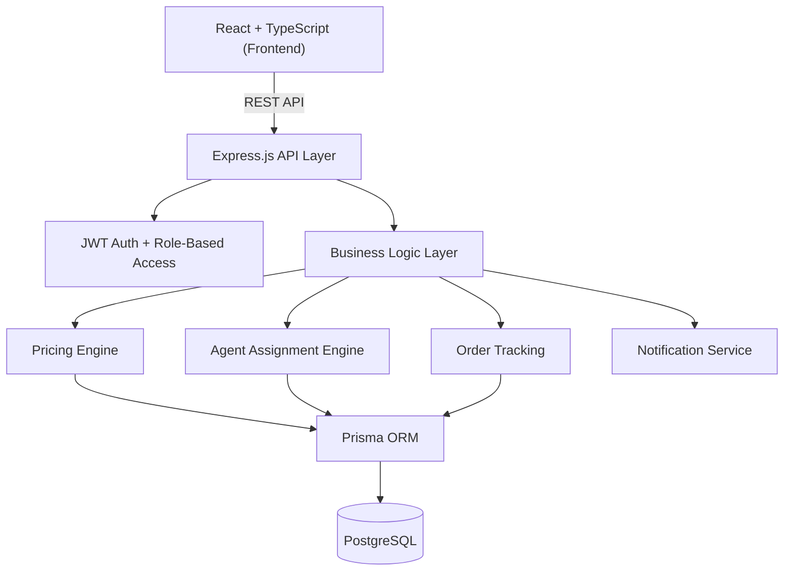
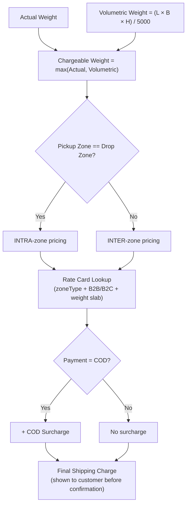
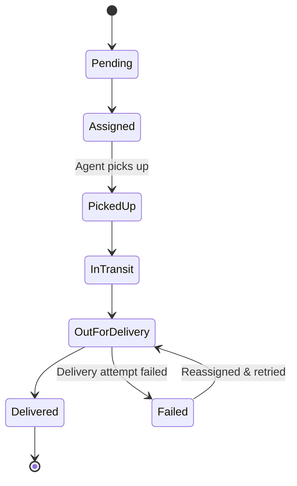
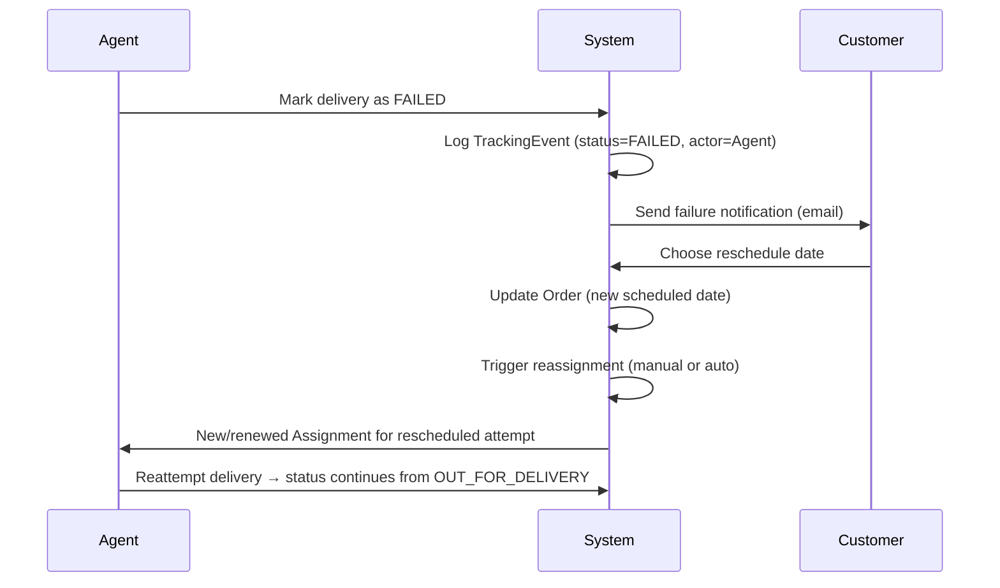
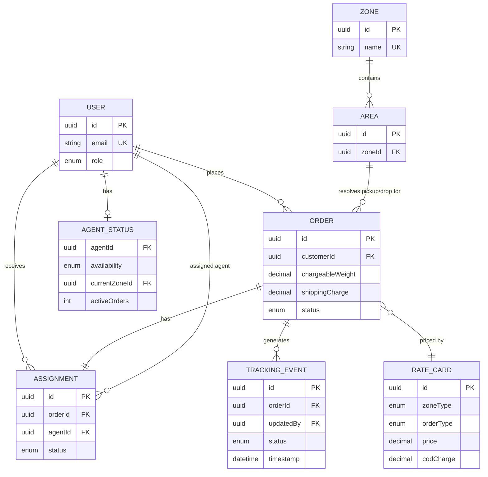

<div align="center">

# 🚚 Last-Mile Delivery Tracker

**A delivery management platform with rule-based pricing, intelligent agent assignment, and end-to-end order tracking — built for the Unthinkable logistics platform assignment.**

[](#)
[](#)
[](#)
[](#)
[](#)
[](#)
[](#license)

**[Live Demo](https://unthinkable-updated-project.vercel.app/)** · **[API (Render)](https://unthinkable-updated-project.onrender.com)** · **[Swagger Docs](https://unthinkable-updated-project.onrender.com/api-docs)**

</div>

---

## 🔗 Quick Links

| Resource | Link |
|---|---|
| 🖥️ Frontend (Live) | https://unthinkable-updated-project.vercel.app/ |
| ⚙️ Backend API | https://unthinkable-updated-project.onrender.com |
| 📘 Swagger UI | https://unthinkable-updated-project.onrender.com/api-docs |
| 📄 API Documentation | [`API_DOCUMENTATION.md`](./API_DOCUMENTATION.md) |
| 🗄️ Database Schema | [`DATABASE_SCHEMA.md`](./DATABASE_SCHEMA.md) |
| 💰 Rate Calculation Logic | [`RATE_CALCULATION.md`](./RATE_CALCULATION.md) |
| 🚀 Deployment Guide | [`DEPLOYMENT.md`](./DEPLOYMENT.md) |
| 🏗️ System Design Write-up (≤800 words) | [`SYSTEM_DESIGN.md`](./SYSTEM_DESIGN.md) |

---

## ✅ Problem Statement Coverage

This project was built against Unthinkable's Last-Mile Delivery Tracker assignment. Every requirement in the brief maps to a concrete part of the implementation:

| Requirement (from brief) | Implementation |
|---|---|
| Pickup/drop address, dimensions, weight, order type, payment type as input | Order creation flow — see **Create Order** screenshot below |
| Auto-calculated charge before confirmation | Pricing Engine section + [`RATE_CALCULATION.md`](./RATE_CALCULATION.md) |
| Zone detection (pickup zone vs drop zone) | Zones/Areas hierarchy — see Pricing Engine diagram |
| Volumetric weight `(L×B×H)/5000`, billed on higher of actual vs volumetric | Pricing Engine section |
| Separate B2B/B2C rate cards, intra/inter-zone rates, COD surcharge — all admin-configurable, **no hardcoding** | `RateCard` entity, Admin → Rate Cards Manager screen |
| Customer registration/login; Admin can create orders on a customer's behalf | Features table, Auth section |
| Manual agent assignment **or** auto-assignment to nearest available agent | Agent Assignment section |
| Agent updates status: Picked Up / In Transit / Out for Delivery / Delivered / Failed | Order Lifecycle diagram |
| Failed delivery → customer notified → reschedule → agent reassigned | **Failed Delivery & Reschedule Flow** section |
| Live status + full tracking timeline for customer | Order Lifecycle section, Customer Dashboard screenshot |
| Email notification on every status change | Notifications section |
| Admin views all orders, filters by status/zone/agent, can override status | Admin features, Admin Orders Queue screenshot |
| Role-based auth (Customer / Agent / Admin) | Authentication & Access Control section |
| Immutable tracking history — status change logged with timestamp + actor | `TrackingEvent` table, [`DATABASE_SCHEMA.md`](./DATABASE_SCHEMA.md) |

---

## 📸 Screenshots

### Landing Page

*Public marketing homepage with live platform metrics (total deliveries, active drivers, routing precision, API response time).*


| Login | Dashboard |
|---|---|
|  |  |


*Order creation flow with pickup/drop address, package dimensions, and real-time price calculation shown before confirmation.*


| Operations Hub | Orders Queue |
|---|---|
|  |  |

| Rate Cards Manager | Staff Management |
|---|---|
|  |  |

*Rate Cards Manager is where admins configure intra/inter-zone rates separately for B2B and B2C, plus COD surcharge — no pricing value is ever hardcoded in the application.*

### Agent Workspace

*Delivery agents accept/reject assignments and update delivery status stop-by-stop, with live dispatch alerts.*

---

## Overview

Last-Mile Delivery Tracker is a full-stack logistics platform implementing configurable pricing rules, intelligent order assignment, immutable shipment tracking, role-based authentication, and operational dashboards for three distinct user roles:

- **Customer** — registers, places orders, sees auto-calculated charges up front, tracks delivery live
- **Delivery Agent** — accepts/rejects assignments, updates delivery status
- **Administrator** — configures zones, areas, and rate cards; manages agents; assigns/reassigns orders; overrides status; views platform-wide analytics



The backend follows a **controller → service → repository** pattern, keeping the pricing and assignment logic testable and out of the route handlers. Full write-up: [`SYSTEM_DESIGN.md`](./SYSTEM_DESIGN.md).

---

## Features

<table>
<tr>
<td valign="top" width="33%">

### 👤 Customer
- Register / Login
- Google Maps address autocomplete
- Create delivery orders
- Auto-calculated shipping cost shown before confirmation
- Live order tracking + full timeline
- Email notifications on every status change
- Order history
- Reschedule failed deliveries

</td>
<td valign="top" width="33%">

### 🛠️ Administrator
- Analytics dashboard
- Manage customers & agents
- Manage zones & assign areas to zones
- Configure rate cards (B2B/B2C, intra/inter-zone, COD surcharge)
- Create orders on a customer's behalf
- Manual & automatic agent assignment
- Override order status
- Filter orders by status / zone / agent

</td>
<td valign="top" width="33%">

### 🏍️ Delivery Agent
- Secure login
- View assigned deliveries
- Accept / reject assignments
- Update status: Picked Up → In Transit → Out for Delivery → Delivered / Failed
- Delivery history

</td>
</tr>
</table>

---

## Pricing engine

Every shipping charge is computed live from rules an admin configures in the Rate Cards Manager — **no zone rate, weight slab, or COD surcharge is hardcoded anywhere in the application code.**



**How each requirement is handled:**
- **Zone detection** — pickup and drop addresses each resolve to an Area, and every Area belongs to a Zone (admin-configured). Matching zones → intra-zone rate; different zones → inter-zone rate.
- **Volumetric weight** — calculated as `(L × B × H) / 5000` on every order; the system bills on whichever is greater, actual or volumetric weight.
- **B2B vs B2C** — rate cards are stored and looked up separately per order type, so the same route can legitimately price differently for a business shipment vs a consumer one.
- **COD surcharge** — added only when `paymentType = COD`, at a rate the admin sets per order type.
- **No hardcoding** — every number in this flow (rates, weight slabs, surcharges) comes from the `RateCard` table, editable by an admin with zero code or deployment changes.

Full worked examples with real numbers: [`RATE_CALCULATION.md`](./RATE_CALCULATION.md)

---

## Agent assignment

| Mode | What happens |
|---|---|
| **Manual** | Admin selects the delivery agent directly from the Admin Console |
| **Automatic** | System selects the nearest available agent based on live availability, current zone, and active order load |

Agent availability is modeled through a dedicated `AgentStatus` record per agent — tracking `availability` (Available/Busy/Offline), `currentZone`, and `activeOrders` count. Auto-assignment queries this table for agents in the matching zone with the lowest current load, so the same signal (availability + zone + load) drives both the assignment decision and the live "who's free right now" view admins see on the dashboard.

Both manual and automatic paths write to the same `Assignment` record, so downstream tracking and history behave identically regardless of how the order was assigned.

---

## Order lifecycle

Every order moves through a defined state machine, and **every status change is logged as a new record, never overwritten** — the tracking timeline is a full audit trail, not just a "current status" field.



Each `TrackingEvent` row captures the **status**, **timestamp**, **actor** (who made the change — agent, customer, or admin), and optional **remarks** — enough to reconstruct exactly what happened to any order, at any point, without losing prior history.

---

## Failed delivery & reschedule flow

This is a named requirement in the brief, so it gets its own flow rather than being folded into the general lifecycle:



Nothing about the original failed attempt is deleted — the reschedule and reassignment are new records layered on top of the existing tracking history.

---

## 🗄️ Database at a glance



This is the trimmed-down view — full field-level schema, indexes, and constraints are in [`DATABASE_SCHEMA.md`](./DATABASE_SCHEMA.md).

| Entity | Purpose |
|---|---|
| `Users` | Customers, agents, and admins, distinguished by role |
| `Orders` | The core delivery record — pricing, addresses, status |
| `AgentStatus` | Live agent availability, zone, and current load |
| `Zones` / `Areas` | The geographic hierarchy driving pricing and assignment |
| `RateCards` | Admin-configurable pricing rules — B2B/B2C, intra/inter-zone, COD surcharge |
| `Assignment` | Links an order to the agent delivering it |
| `TrackingEvent` | Immutable, append-only status history per order (status + timestamp + actor) |

---

## Authentication & access control

Role-based access across three roles — **Customer**, **Delivery Agent**, **Administrator** — each with distinct permissions enforced at the API layer, not just hidden in the UI:

- JWT access + refresh tokens
- Passwords hashed with bcrypt, never stored in plain text
- Role-based authorization middleware on every protected route
- Centralized error handling for consistent, predictable API responses

---

## Tech stack

| Layer | Technologies |
|---|---|
| **Frontend** | React, TypeScript, Vite, React Router, Tailwind CSS, React Hook Form, Axios |
| **Backend** | Node.js, Express.js, TypeScript, Prisma ORM, JWT, Zod, Bcrypt, Nodemailer |
| **Database** | PostgreSQL |
| **Deployment** | Vercel (frontend) · Render (backend) |

Prisma was chosen over a raw query builder for its migration workflow and compile-time type safety across the pricing and assignment logic, where a typo in a field name would otherwise fail silently at runtime. Zod validates every request at the API boundary so invalid input never reaches the service layer.

---

## Project structure

```
Unthinkable-updated-project/
│
├── backend/
├── frontend/
├── docs/
│
├── README.md
├── API_DOCUMENTATION.md
├── DATABASE_SCHEMA.md
├── RATE_CALCULATION.md
├── DEPLOYMENT.md
├── SYSTEM_DESIGN.md
├── landing-page.png
├── customer-login.png
├── customer-dashboard.png
├── create-order.png
├── admin-dashboard.png
├── admin-orders-queue.png
├── admin-rate-cards.png
├── admin-staff-management.png
├── agent-workspace.png
├── package.json
└── package-lock.json
```

---

## Getting started

### Clone it

```bash
git clone https://github.com/pruthvimotade/Unthinkable-updated-project.git
cd Unthinkable-updated-project
```

### Backend

```bash
cd backend
npm install
cp .env.example .env   # fill in the values below
npm run prisma:generate
npm run prisma:migrate
npm run seed
npm run dev
```

### Frontend

```bash
cd frontend
npm install
npm run dev
```

### Environment variables

A committed [`.env.example`](./backend/.env.example) lists every variable the backend needs; copy it to `.env` and fill in real values:

```env
DATABASE_URL=
JWT_SECRET=
JWT_REFRESH_SECRET=
GOOGLE_MAPS_API_KEY=
SMTP_HOST=
SMTP_PORT=
SMTP_USER=
SMTP_PASS=
FRONTEND_URL=
BACKEND_URL=
```

---

## Deliverables (per assignment brief)

| Deliverable | Status / Location |
|---|---|
| Complete source code | This repository (`frontend/`, `backend/`) |
| README with setup guide, `.env.example`, API docs, DB schema, rate calculation explanation | This file + linked docs below |
| Hosted application URL | [Live Demo](https://unthinkable-updated-project.vercel.app/) (Vercel) · [API](https://unthinkable-updated-project.onrender.com) (Render) |
| System design write-up (≤800 words): rate engine, zone detection, auto-assignment, failed delivery handling | [`SYSTEM_DESIGN.md`](./SYSTEM_DESIGN.md) |

## Documentation

- API Documentation → [`API_DOCUMENTATION.md`](./API_DOCUMENTATION.md)
- Database Schema → [`DATABASE_SCHEMA.md`](./DATABASE_SCHEMA.md)
- Rate Calculation Logic → [`RATE_CALCULATION.md`](./RATE_CALCULATION.md)
- Deployment Guide → [`DEPLOYMENT.md`](./DEPLOYMENT.md)
- System Design Write-up → [`SYSTEM_DESIGN.md`](./SYSTEM_DESIGN.md)

---

## What's next

Beyond the assignment scope, a few things worth adding:

- [ ] Real-time GPS tracking for agents
- [ ] Route optimization for agents with multiple stops
- [ ] Payment gateway integration for prepaid orders
- [ ] Mobile app for agents
- [ ] Driver performance analytics
- [ ] Delivery heatmaps for zone planning

---

## Author

**Pruthviraj Motade**
Computer Engineering undergrad, Vishwakarma Institute of Technology, Pune.

[](https://github.com/pruthvimotade)
[](https://www.linkedin.com/in/pruthvimotade/)

---

## License

MIT — see [`LICENSE`](./LICENSE).
