<div align="center">

# 🚚 Last-Mile Delivery Tracker

**A logistics platform that actually thinks like one.**
Dynamic pricing, zone-aware routing, smart agent assignment, and live order tracking — built the way a real courier backend needs to work, not the way a CRUD tutorial does.

[](#)
[](#)
[](#)
[](#)
[](#)
[](#)
[](#license)

**[Live Demo](https://unthinkable-updated-project.vercel.app/)** · **[API (Render)](https://unthinkable-updated-project.onrender.com)** · **[Swagger Docs](https://unthinkable-updated-project.onrender.com/api-docs)**

</div>

---

## 🔗 Quick Links

| Resource | Link |
|---|---|
| 🖥️ Frontend (Live) | https://unthinkable-updated-project.vercel.app/ |
| ⚙️ Backend API | https://unthinkable-updated-project.onrender.com |
| 📘 Swagger UI | https://unthinkable-updated-project.onrender.com/api-docs |
| 📄 API Documentation | [`API_DOCUMENTATION.md`](./API_DOCUMENTATION.md) |
| 🗄️ Database Schema | [`DATABASE_SCHEMA.md`](./DATABASE_SCHEMA.md) |
| 💰 Rate Calculation | [`RATE_CALCULATION.md`](./RATE_CALCULATION.md) |
| 🚀 Deployment Guide | [`DEPLOYMENT.md`](./DEPLOYMENT.md) |
| 🏗️ System Design | [`SYSTEM_DESIGN.md`](./SYSTEM_DESIGN.md) |

---

## Why I built this

Most "delivery app" side projects stop at CRUD — create an order, save it, list it. That's not the part of logistics that's actually hard.

The interesting problems are things like: *how do you price a shipment fairly without hardcoding numbers into your code? How do you tell if a delivery is local or cross-city? How do you pick the right driver out of dozens who are currently free? How do you keep a tamper-proof record of a package's entire journey?*

I built Last-Mile Delivery Tracker to answer those — a rate-card-driven pricing engine, zone-based routing, manual **and** automatic agent assignment, and an append-only tracking timeline for every order, all wrapped in a real role-based (Customer / Agent / Admin) application with its own auth, dashboards, and permissions per role.

---

## 📸 Screenshots

### Landing Page
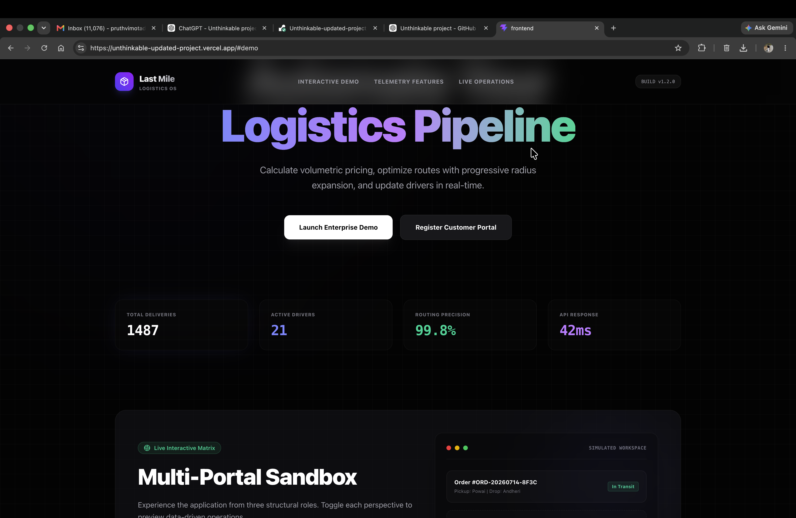
*Public marketing homepage with live platform metrics (total deliveries, active drivers, routing precision, API response time).*

### Customer Portal

| Login | Dashboard |
|---|---|
| 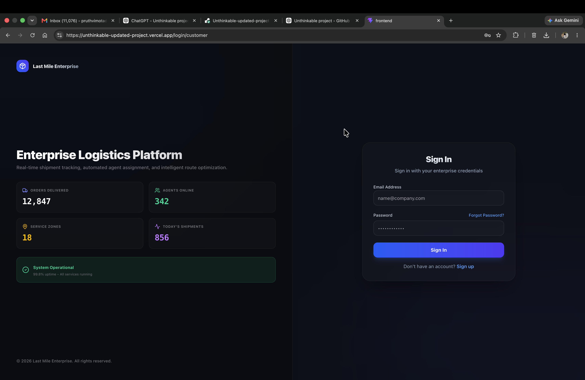 | 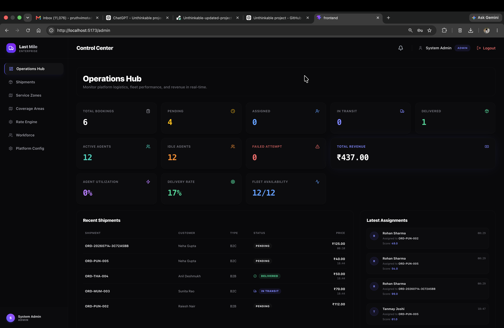 |

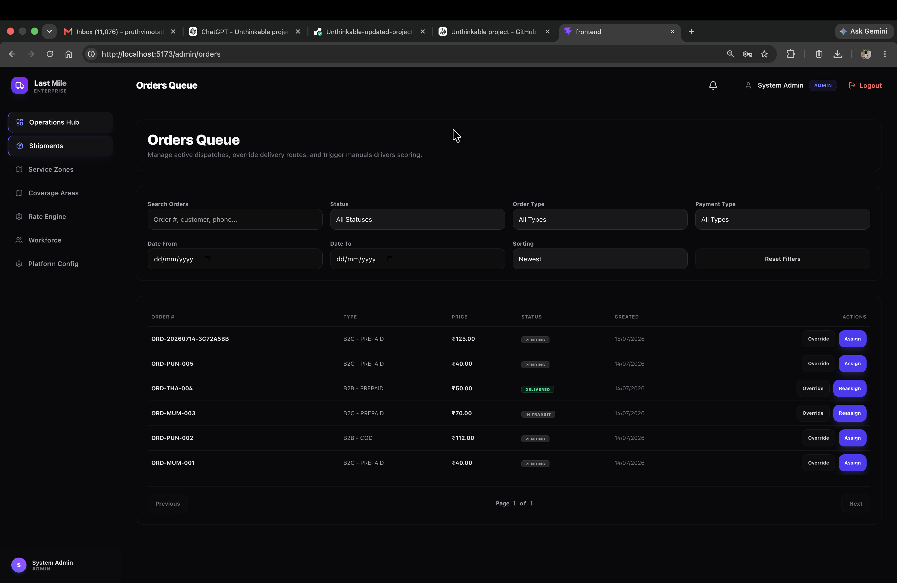
*Order creation flow with pickup/drop address, package dimensions, and real-time price calculation.*

### Admin Console

| Operations Hub | Orders Queue |
|---|---|
| 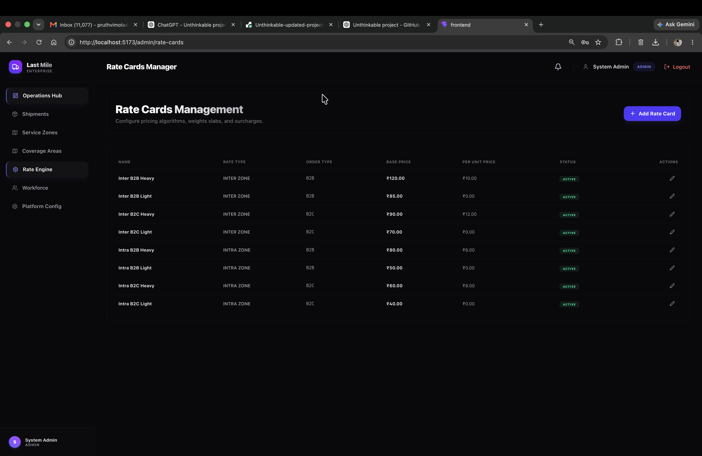 | 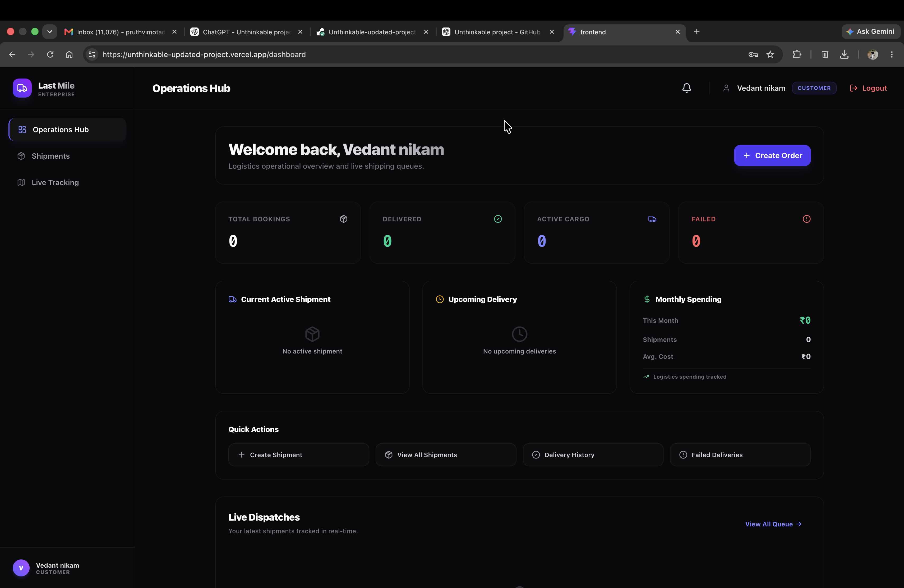 |

| Rate Cards Manager | Staff Management |
|---|---|
| 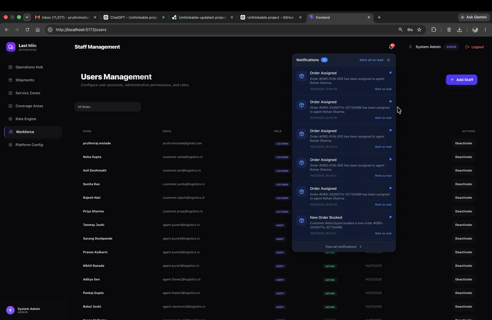 | 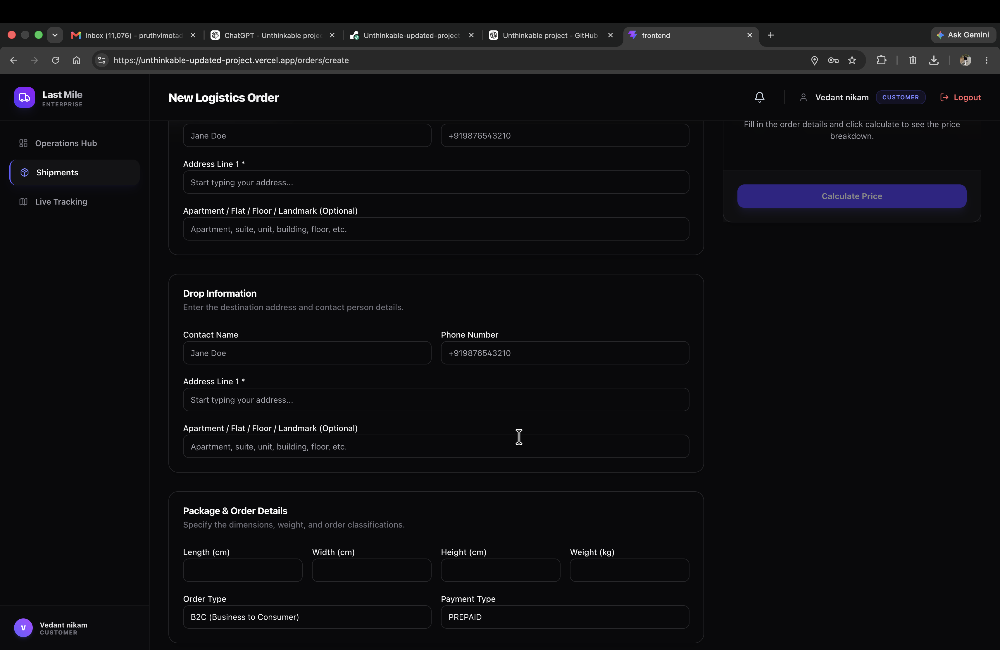 |

### Agent Workspace
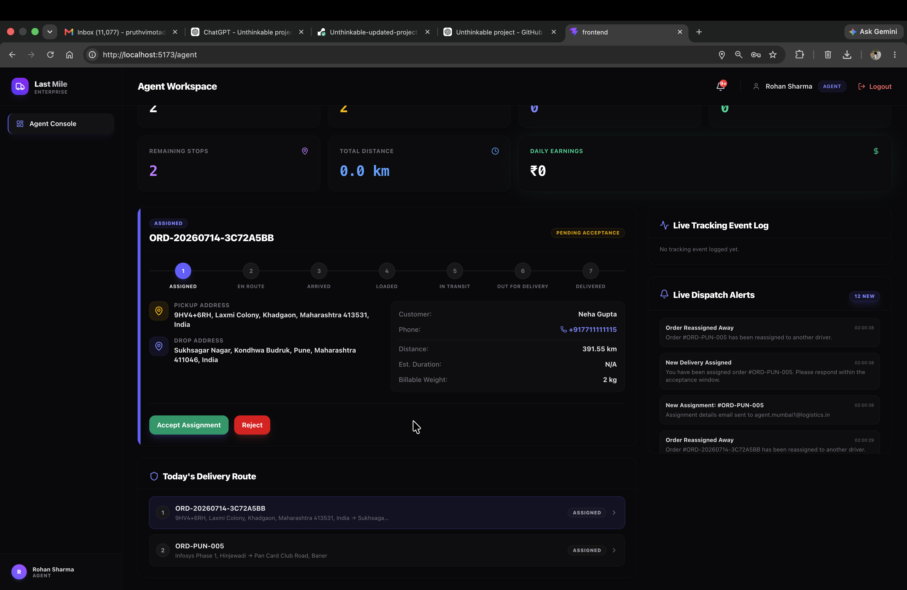
*Delivery agents accept/reject assignments and track their route stop-by-stop, with live dispatch alerts.*

---

## Overview

Last-Mile Delivery Tracker is a full-stack logistics platform designed to simulate how modern courier companies actually manage deliveries — configurable pricing rules, intelligent order assignment, shipment tracking, role-based authentication, and operational dashboards, not just a list of orders in a database.

Three roles, each with their own auth, dashboard, permissions, and workflow:

- **Customer** — places and tracks orders
- **Delivery Agent** — fulfills them
- **Administrator** — configures and oversees the whole system

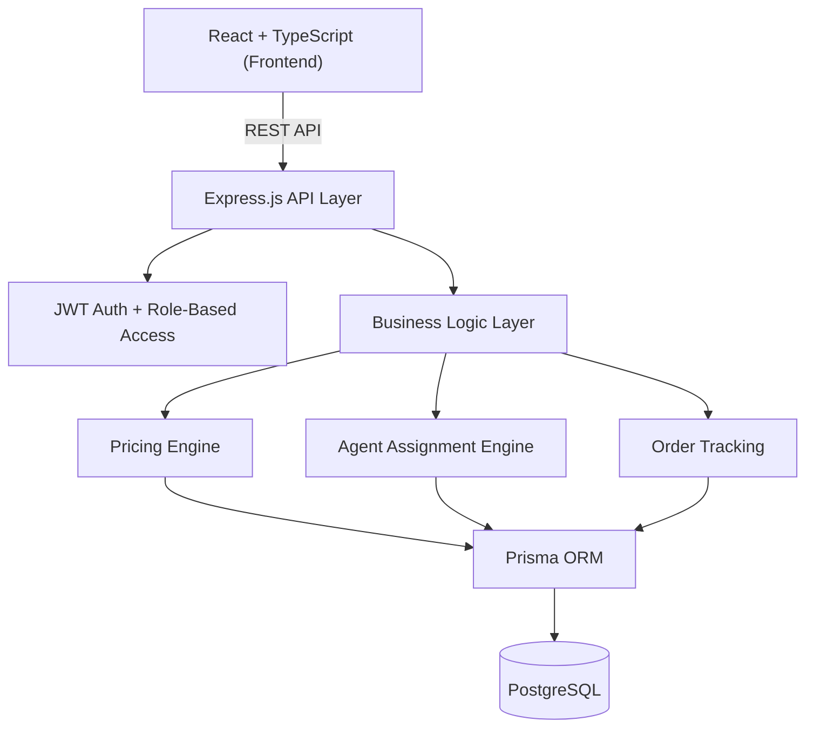

The backend follows a **controller → service → repository** pattern, which kept the pricing and assignment logic testable and out of the route handlers. Full breakdown in [`SYSTEM_DESIGN.md`](./SYSTEM_DESIGN.md).

---

## Features

<table>
<tr>
<td valign="top" width="33%">

### 👤 Customer
- Register / Login
- Google Maps address autocomplete
- Create delivery orders
- Automatic shipping cost calculation
- Track orders live
- Email notifications
- Order history

</td>
<td valign="top" width="33%">

### 🛠️ Administrator
- Analytics dashboard
- Manage customers & agents
- Manage zones & service areas
- Configure pricing rate cards
- Create orders on a customer's behalf
- Manual & automatic assignment
- Override order status
- Search & filter orders

</td>
<td valign="top" width="33%">

### 🏍️ Delivery Agent
- Secure login
- View assigned deliveries
- Accept / reject assignments
- Update delivery status
- Delivery history

</td>
</tr>
</table>

---

## Pricing engine

This is the part I spent the most time on, because it's the part most tutorial projects skip entirely. Every shipping charge is computed live from rules an admin configures — nothing is hardcoded in application code.

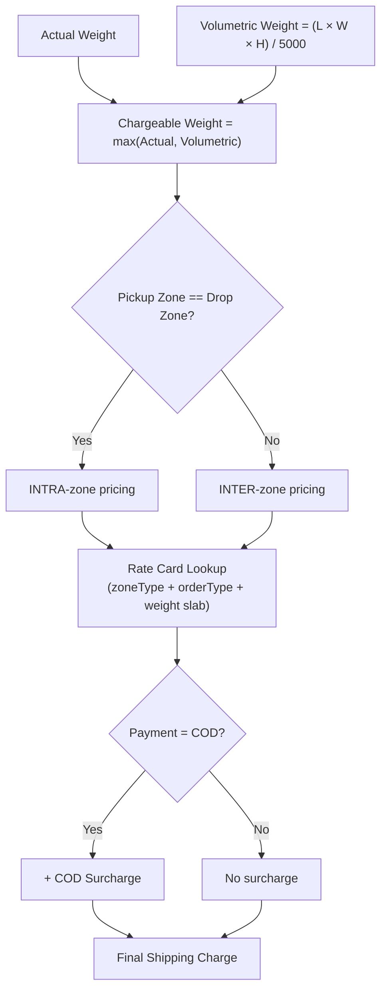

Volumetric weight uses the same formula real couriers use — whichever number is bigger, actual or volumetric, is what gets billed. It's why a large-but-light box often costs more to ship than people expect, and this platform models that correctly instead of ignoring it.

Full worked examples: [`RATE_CALCULATION.md`](./RATE_CALCULATION.md)

---

## Agent assignment

| Mode | What happens |
|---|---|
| **Manual** | An admin picks the agent directly — useful for VIP orders or edge cases |
| **Automatic** | The system picks the best available agent based on live availability, assigned zone, and current workload |

Both paths write to the same `Assignment` record, so tracking and history behave identically no matter how the order was assigned.

---

## Order lifecycle

Every order moves through a defined state machine, and **every transition is logged, never overwritten** — the tracking timeline is a real audit trail, not just a "current status" field.

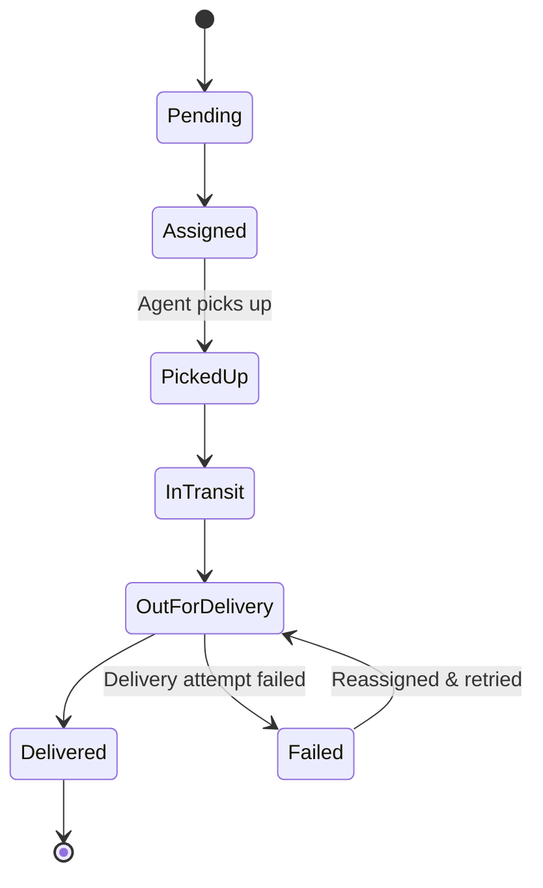

Failed deliveries get reassigned automatically while the full tracking history stays intact — nothing gets erased, only appended to.

---

## 🗄️ Database at a glance

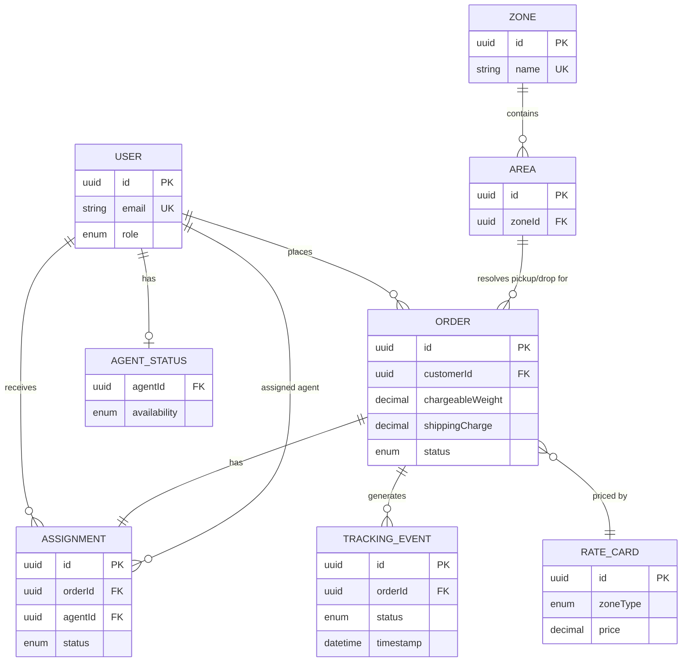

This is the trimmed-down view — full field-level schema, indexes, and constraints live in [`DATABASE_SCHEMA.md`](./DATABASE_SCHEMA.md).

| Entity | Purpose |
|---|---|
| `Users` | Customers, agents, and admins, distinguished by role |
| `Orders` | The core delivery record — pricing, addresses, status |
| `AgentStatus` | Live agent availability, zone, and current load |
| `Zones` / `Areas` | The geographic hierarchy driving pricing and assignment |
| `RateCards` | Admin-configurable pricing rules — no hardcoded prices |
| `Assignment` | Links an order to the agent delivering it |
| `TrackingEvent` | Immutable, append-only status history per order |

---

## Tech stack

| Layer | Technologies |
|---|---|
| **Frontend** | React, TypeScript, Vite, React Router, Tailwind CSS, React Hook Form, Axios |
| **Backend** | Node.js, Express.js, TypeScript, Prisma ORM, JWT, Zod, Bcrypt, Nodemailer |
| **Database** | PostgreSQL |
| **Deployment** | Vercel (frontend) · Render (backend) |

I picked Prisma over a raw query builder mainly for the migration workflow and type safety across the pricing and assignment logic, where a typo in a field name would otherwise fail silently at runtime. Zod validates requests at the boundary so bad input never reaches the service layer.

---

## Project structure

```
Unthinkable-updated-project/
│
├── backend/
├── frontend/
├── docs/
│
├── README.md
├── API_DOCUMENTATION.md
├── DATABASE_SCHEMA.md
├── RATE_CALCULATION.md
├── DEPLOYMENT.md
├── SYSTEM_DESIGN.md
├── landing-page.png
├── customer-login.png
├── customer-dashboard.png
├── create-order.png
├── admin-dashboard.png
├── admin-orders-queue.png
├── admin-rate-cards.png
├── admin-staff-management.png
├── agent-workspace.png
├── package.json
└── package-lock.json
```

---

## Getting started

### Clone it

```bash
git clone https://github.com/pruthvimotade/Unthinkable-updated-project.git
cd Unthinkable-updated-project
```

### Backend

```bash
cd backend
npm install
npm run prisma:generate
npm run prisma:migrate
npm run seed
npm run dev
```

### Frontend

```bash
cd frontend
npm install
npm run dev
```

### Environment variables

Create a `.env` file inside `backend/`:

```env
DATABASE_URL=
JWT_SECRET=
JWT_REFRESH_SECRET=
GOOGLE_MAPS_API_KEY=
SMTP_HOST=
SMTP_PORT=
SMTP_USER=
SMTP_PASS=
FRONTEND_URL=
BACKEND_URL=
```

---

## Documentation

- API Documentation → [`API_DOCUMENTATION.md`](./API_DOCUMENTATION.md)
- Database Schema → [`DATABASE_SCHEMA.md`](./DATABASE_SCHEMA.md)
- Rate Calculation → [`RATE_CALCULATION.md`](./RATE_CALCULATION.md)
- Deployment Guide → [`DEPLOYMENT.md`](./DEPLOYMENT.md)
- System Design → [`SYSTEM_DESIGN.md`](./SYSTEM_DESIGN.md)

---

## What's next

Things I'd want to add if this went further:

- [ ] Real-time GPS tracking
- [ ] Route optimization for agents with multiple stops
- [ ] Payment gateway integration
- [ ] Mobile app for agents
- [ ] Push notifications
- [ ] Driver performance analytics
- [ ] Delivery heatmaps for zone planning

---

## About me

**Pruthviraj Motade**
Computer Engineering undergrad at Vishwakarma Institute of Technology, Pune. I like building systems where the "boring" business logic — pricing, state machines, permissions — is actually the interesting part.

[](https://github.com/pruthvimotade)
[](https://www.linkedin.com/in/pruthvimotade/)

---

## License

MIT — see [`LICENSE`](./LICENSE). Fork it, break it, learn from it.
