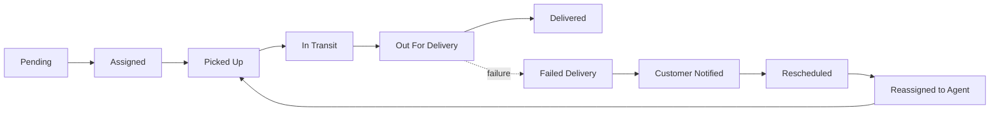
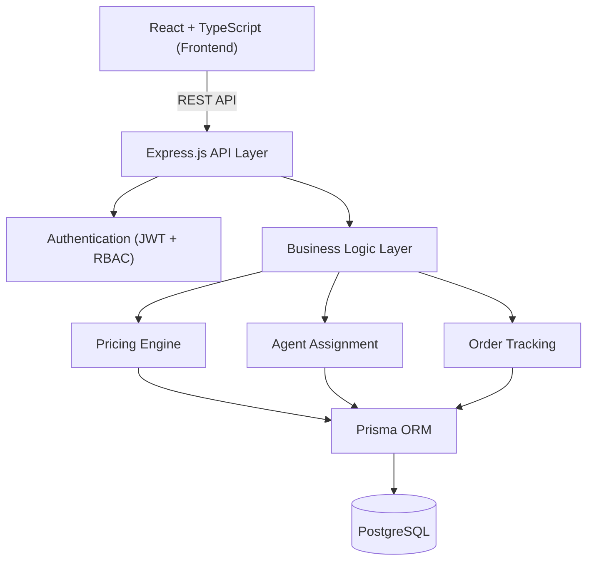

<div align="center">

# 🚚 Last-Mile Delivery Tracker

**A logistics platform that actually thinks like one.**
Dynamic pricing, zone-aware routing, smart agent assignment, and live order tracking — built the way a real courier backend would need to work, not the way a tutorial says it should.

[](#)
[](#)
[](#)
[](#)
[](#)
[](#)
[](#license)

[Live Demo](#) · [API Docs](./docs/API_DOCUMENTATION.md) · [Database Schema](./docs/DATABASE_SCHEMA.md) · [Report Bug](../../issues) · [Request Feature](../../issues)

</div>

---

## Why I built this

Most "delivery app" projects stop at CRUD — create an order, save it, show it in a list. That's not really what makes logistics hard.

The interesting problems are things like: *how do you price a shipment fairly without hardcoding numbers into your code? How do you know if a delivery is local or cross-city? How do you pick the right driver out of dozens who are available? How do you keep a tamper-proof history of a package's journey?*

I wanted to build something closer to what actually runs behind a company like Delhivery or Shiprocket — even at a small scale — so I built Last-Mile Delivery Tracker as a full end-to-end system: a pricing engine driven entirely by configurable rate cards, zone-based routing logic, an agent-assignment system that can run manually or automatically, and an immutable tracking timeline for every order, wrapped in a proper role-based (Customer / Agent / Admin) application.

It's not a demo I'm trying to dress up — it's the kind of backend problem I enjoy solving.

---

## What it actually does

| Problem | How this project solves it |
|---|---|
| **Pricing shouldn't be hardcoded** | Rate-card-driven pricing engine — admins configure slabs, the system does the math |
| **Distance/zone affects cost** | Pickup and drop addresses resolve to zones, classifying every shipment as intra- or inter-zone |
| **Weight isn't just weight** | Uses the industry-standard volumetric weight formula and bills whichever figure is higher |
| **Someone has to deliver it** | Orders can be assigned manually by an admin, or automatically based on agent availability, zone, and load |
| **"Where's my order?" needs a real answer** | Every status change is written as a permanent, append-only tracking event — never overwritten |
| **Not everyone should see everything** | JWT-based auth with genuinely separate Customer / Agent / Admin permissions, not just a hidden UI toggle |

---

## Feature breakdown

<table>
<tr>
<td valign="top" width="33%">

### 👤 Customer
- Register & log in securely
- Create delivery orders
- Google Maps address autocomplete
- Instant shipping-cost calculation
- Live order tracking + full timeline
- Email notifications at every milestone
- Order history

</td>
<td valign="top" width="33%">

### 🛠️ Admin
- Analytics dashboard
- Manage zones & service areas
- Configure rate cards (no code changes needed)
- Manage agents & customers
- Create orders on a customer's behalf
- Manual **or** automatic agent assignment
- Override order status when things go sideways
- Search & filter across all orders

</td>
<td valign="top" width="33%">

### 🏍️ Delivery Agent
- Secure login
- Dashboard of assigned orders
- Accept or reject assignments
- Update delivery status in real time
- Delivery history
- Full pickup-to-delivery workflow

</td>
</tr>
</table>

---

## How the pricing engine works

This was the part I spent the most time on, because it's the part most tutorial projects skip. Every shipping charge is computed live from rules an admin configures — nothing is ever hardcoded in application code.

```
Actual Weight ──┐
                ├──▶ Chargeable Weight = max(Actual, Volumetric)
Volumetric Wt ──┘              │
                                ▼
                        Zone Detection (Intra / Inter)
                                │
                                ▼
                      B2B / B2C Rate Card Lookup
                                │
                                ▼
                    COD Surcharge (if applicable)
                                │
                                ▼
                       Final Shipping Charge
```

Volumetric weight uses the same formula couriers like FedEx and DHL actually use:

$$\text{Volumetric Weight} = \frac{L \times W \times H}{5000}$$

Whichever number is bigger — actual or volumetric — is what gets billed. This alone is why a lot of "small but bulky" packages cost more to ship than people expect, and now the platform models that correctly instead of ignoring it.

**Zone detection** happens the same way real logistics networks do it: pickup and drop addresses each resolve to an Area, and every Area belongs to a Zone. If the pickup and drop zones match, it's priced as intra-zone; if not, inter-zone — and that classification feeds straight into the rate card lookup.

---

## Agent assignment

| Mode | What happens |
|---|---|
| **Manual** | An admin picks the agent directly — useful for VIP orders or edge cases |
| **Automatic** | The system picks the best available agent based on live availability, assigned zone, and current delivery load |

Both paths converge on the same `Assignment` record, so tracking and history work identically no matter how the order got assigned.

---

## Order lifecycle

Every order moves through a defined state machine, and **every transition is logged, never overwritten** — so the tracking timeline is a real audit trail, not just a "current status" field.



Each tracking record captures the **status**, **timestamp**, **who made the change**, and **remarks** — enough to reconstruct exactly what happened to any order, at any point.

Customers get notified automatically at every milestone: order created, agent assigned, picked up, in transit, out for delivery, delivered (or failed, with a reschedule path).

---

## System architecture



The backend follows a **controller → service → repository** pattern, which kept the pricing and assignment logic testable and out of the route handlers. Full breakdowns of the API and database live in `/docs` — linked below.

---

## Tech stack

| Layer | Technologies |
|---|---|
| **Frontend** | React, TypeScript, Vite, React Router, React Hook Form, Tailwind CSS, Axios, Google Maps API |
| **Backend** | Node.js, Express.js, TypeScript, Prisma ORM, JWT, Bcrypt, Zod, Nodemailer |
| **Database** | PostgreSQL |
| **Deployment** | Vercel (frontend) · Render (backend) · managed PostgreSQL |

I chose Prisma over a raw query builder mainly for the migration workflow and type safety across the pricing and assignment logic, where a typo in a field name would otherwise fail silently at runtime. Zod handles request validation at the boundary so bad input never reaches the service layer.

---

## Project structure

```
last-mile-delivery-tracker/
├── frontend/               # React + TypeScript client
├── backend/                # Express + Prisma API
├── docs/
│   ├── SYSTEM_DESIGN.md
│   ├── API_DOCUMENTATION.md
│   ├── DATABASE_SCHEMA.md
│   ├── RATE_CALCULATION.md
│   └── FEATURES.md
├── screenshots/
└── README.md
```

---

## Authentication & access control

Three roles — Customer, Delivery Agent, Administrator — each with genuinely different permissions enforced at the API layer, not just hidden in the UI:

- JWT access + refresh tokens
- Passwords hashed with bcrypt, never stored in plain text
- Role-based authorization middleware on every protected route
- Centralized error handling so failures return consistent, predictable responses

---

## Database at a glance

| Entity | Purpose |
|---|---|
| `Users` | Customers, agents, and admins, distinguished by role |
| `Orders` | The core delivery record — pricing, addresses, status |
| `AgentStatus` | Live agent availability, zone, and current load |
| `Zones` / `Areas` | The geographic hierarchy driving pricing and assignment |
| `RateCards` | Admin-configurable pricing rules — no hardcoded prices |
| `Assignment` | Links an order to the agent delivering it |
| `TrackingEvent` | Immutable, append-only status history per order |

Full ER diagram and field-level breakdown: [`docs/DATABASE_SCHEMA.md`](./docs/DATABASE_SCHEMA.md)

---

## Getting started

### 1. Clone it

```bash
git clone https://github.com/pruthvimotade/last-mile-delivery-tracker.git
cd last-mile-delivery-tracker
```

### 2. Set up the backend

```bash
cd backend
npm install
cp .env.example .env
npm run prisma:generate
npm run prisma:migrate
npm run seed
npm run dev
```

### 3. Set up the frontend

```bash
cd frontend
npm install
npm run dev
```

### 4. Environment variables

Create a `.env` file inside `backend/`:

```env
DATABASE_URL=
JWT_SECRET=
JWT_REFRESH_SECRET=
GOOGLE_MAPS_API_KEY=
SMTP_HOST=
SMTP_PORT=
SMTP_USER=
SMTP_PASS=
FRONTEND_URL=
BACKEND_URL=
```

---

## API documentation

Full endpoint reference, request/response examples, and status-code conventions: [`docs/API_DOCUMENTATION.md`](./docs/API_DOCUMENTATION.md)

Interactive Swagger docs (once the backend is running):

| Environment | URL |
|---|---|
| Local | `http://localhost:4000/docs` |
| Hosted | `https://<your-render-url>/docs` |

---

## Screenshots

> Coming soon — Login · Customer Dashboard · Create Order · Live Tracking · Admin Analytics · Rate Card Config · Agent Dashboard

---

## What's next

Things I'd want to add if this went further:

- [ ] Real-time GPS tracking instead of manual status updates
- [ ] Route optimization for agents with multiple stops
- [ ] SMS notifications alongside email
- [ ] Delivery-time prediction based on historical data
- [ ] Payment gateway integration for prepaid orders
- [ ] Multi-warehouse support
- [ ] Driver performance analytics
- [ ] Delivery heatmaps for zone planning
- [ ] Push notifications
- [ ] A proper mobile app for agents

---

## About me

**Pruthviraj Motade**
Computer Engineering undergrad at Vishwakarma Institute of Technology, Pune. I like building systems where the "boring" business logic — pricing, state machines, permissions — is actually the interesting part.

[](https://github.com/pruthvimotade)
[](https://www.linkedin.com/in/pruthvimotade/)

---

## License

MIT — see [`LICENSE`](./LICENSE). Fork it, break it, learn from it.
